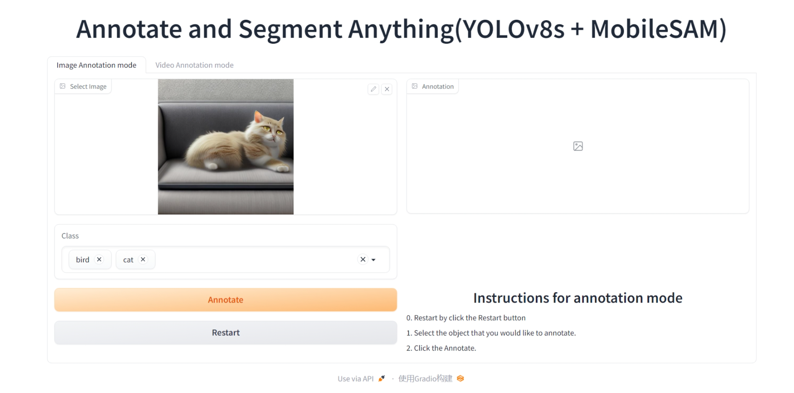
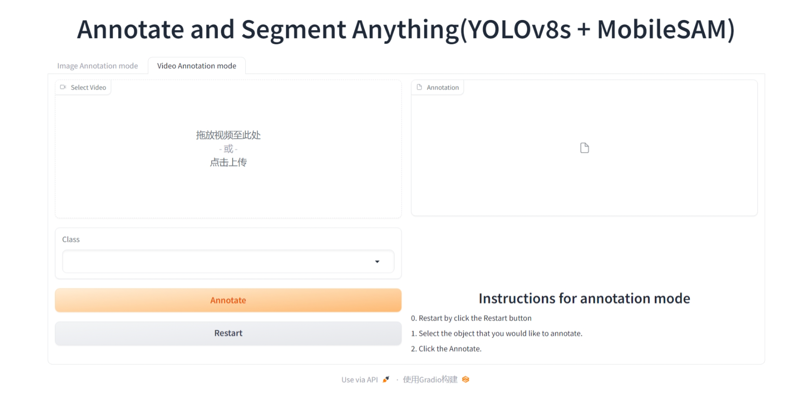

# YOLOv8 + MobileSAM实现自动标注

本仓库提供在1684x上部署自动标注的demo。

# 安装
`pip install -r requirements.txt`

# 启动应用
`python app.py`

# 标注图片
上传图片，选取需要标注的类别（可多选），点击Annotate，标注结果显示在右侧。

# 标注视频
上传视频，选取需要标注的类别（单选），点击Annotate，标注完成的视频在右侧可下载。

