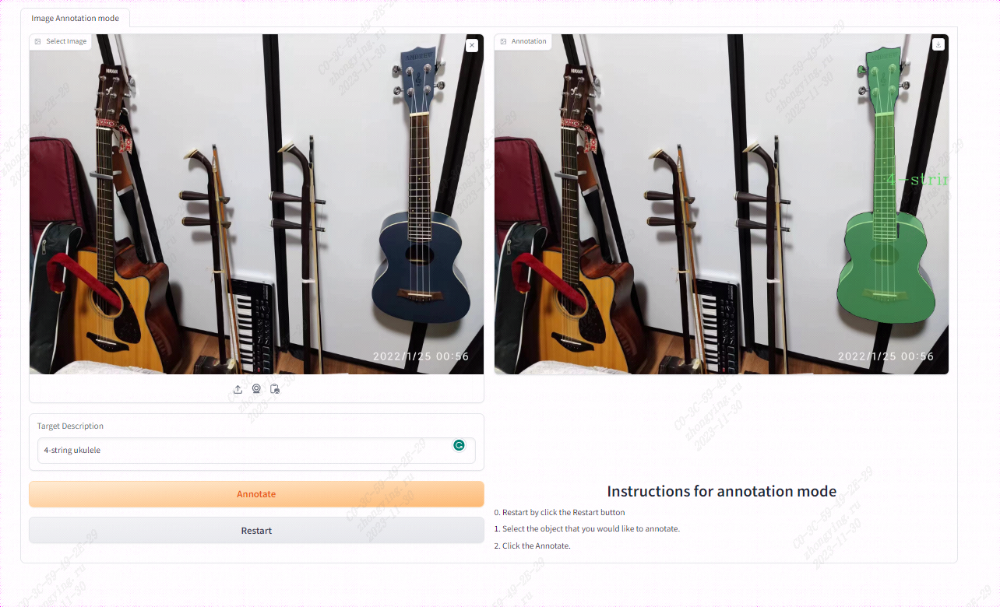
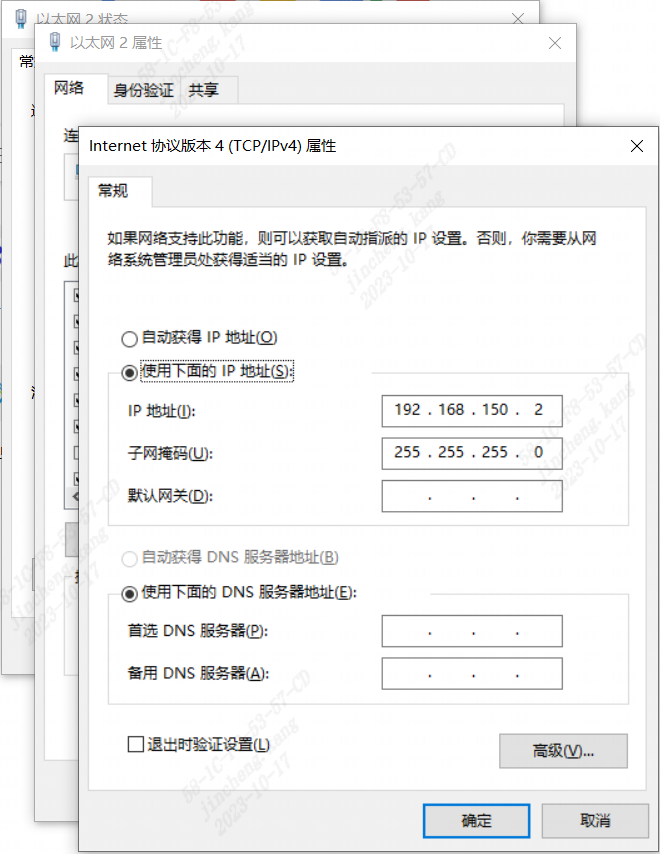
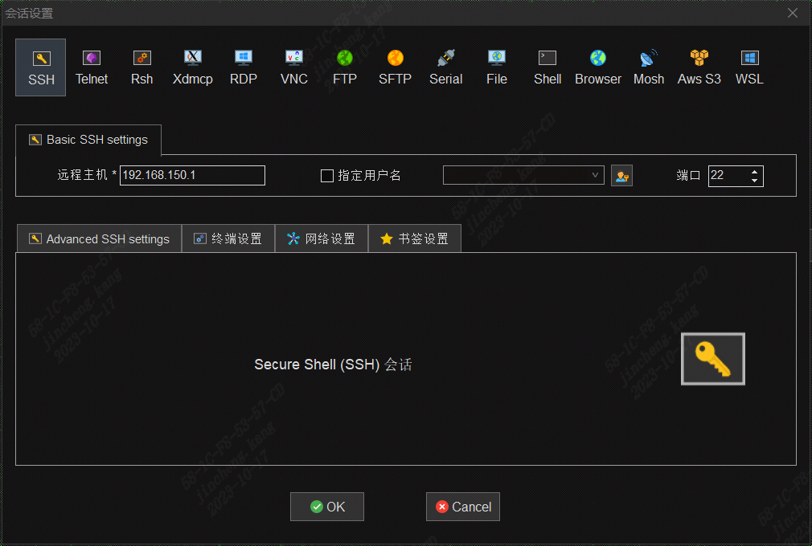
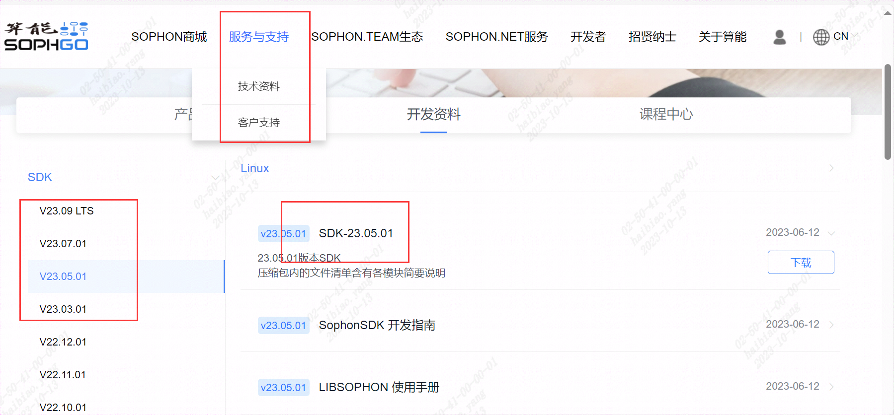
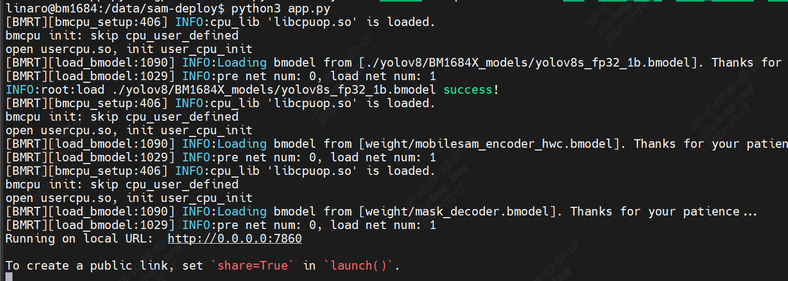

## YOLOv8/GroundingDINO + MobileSAM在AirBox上实现自动标注

本文档将介绍如何在AirBox部署YOLOv8/GroundingDINO + MobileSAM程序，实现自动标注（图片或者视频）的功能。

###  1、连接AirBox

将AirBox通过WAN口与计算机相连，然后设置计算机端的IP地址。

以windows操作系统为例，打开`控制面板\网络和 Internet\网络和共享中心`，点击`以太网2——>属性`，手动设置IP地址为192.168.150.2，如图所示。连接成功后，AirBox的IP即是192.168.150.1。

然后把网线插到LAN口AirBox就可以接入互联网了。

###  2、环境配置

打开ssh远程连接工具。以mobaxterm为例：点击`会话——>SSH`，远程主机填192.168.150.1，其他选项默认，点击”OK“。

用户名：linaro

密码：linaro

然后安装SDK，在[算能官网](https://developer.sophgo.com/site/index/material/37/all.html)下载SDK-23.05.01：

下载好之后，请到`Release_230501-public.zip\Release_230501-public\sophon-sail_20230605_085400\sophon-sail_3.5.0.tar.gz\sophon-sail_3.5.0.tar\sophon-sail\python_wheels\soc\libsophon-0.4_sophonmw-0.6\py38\`路径下提取`sophon_arm-3.5.0-py3-none-any.whl`文件到AirBox上。

将whl文件拷贝到AirBox的/data下，输入`pip3 install "/data/sophon_arm-3.5.0-py3-none-any.whl"`安装SDK。

###  3、文件下载

GitHub链接如下：https://github.com/ZillaRU/AnnoSeg

将项目文件拷贝到AirBox的/data下。

###  4、运行程序

安装依赖：`pip3 install -r requirements.txt`，运行`python3 app.py --det_method groundingdino`（使用GroundingDINO作为检测方法）或 `python3 app.py --det_method yolov8s`。
如果有包没安装pip安装即可，运行成功截图如下：

这里我的端口是7860，在浏览器中`192.168.150.1:7860`即可愉快的玩耍啦~

# YoloV8版 标注图片
上传图片，选取需要标注的类别（可多选），点击Annotate，标注结果显示在右侧。

# GroundingDINO版 标注图片
上传图片，描述需要标注的物体，点击Annotate，标注结果显示在右侧。

# YoloV8版 标注视频
上传视频，选取需要标注的类别（单选），点击Annotate，标注完成的视频在右侧可下载。

